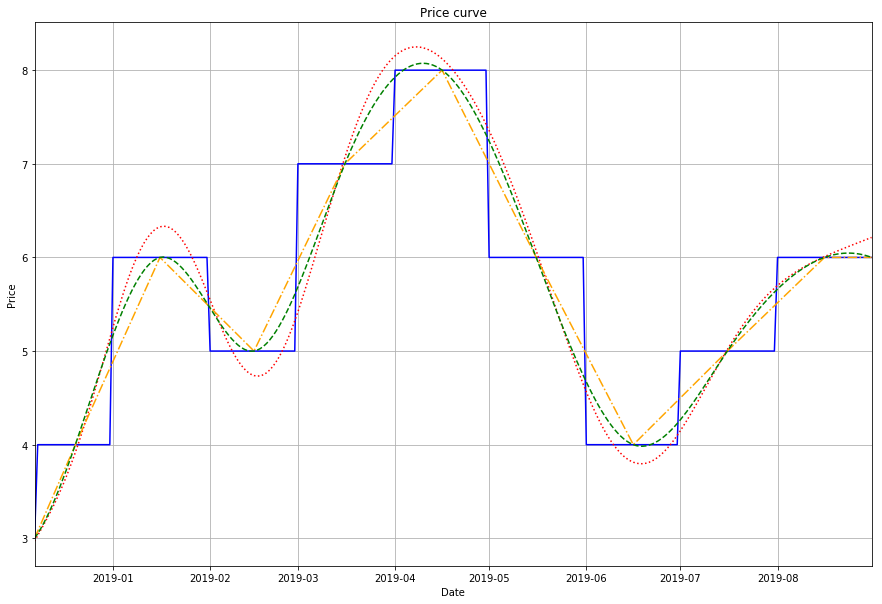

# Curvy
The Smooth Forward Price Curve builder for Python you never thought you needed.

This library is based on theory from "[Constructing forward price curves in electricity
markets](http://citeseerx.ist.psu.edu/viewdoc/download?doi=10.1.1.470.8485&rep=rep1&type=pdf)" by Fleten and Lemming. The curve is created by solving a constrained optimization problem that ensures that the curve maintains the correct average value for each price period while being smooth and continuous.

The library takes a list of forward curve prices and automatically assigns them to a period in the following order: Day Ahead (DA), Bound of Month (BOM), End of Month (EOM) 1, EOM 2, etc... Currently, this is the only format the library supports, but the curve builder is not restricted to this format. If needed, it is very possible to build custom formats and optimize the curve over this.

### The simple way
The easiest way to build the forward price curve is to use the `build_smfc_curve` function. It takes in a list of forward prices and the starting date for trading. For our example, the first value in the forward price list would be the Day Ahead price, so the starting date is actually one day before the first forward price in the list.

Example: 
Given a list for forward prices: `[3, 4, 6, 5]`
Say `start_date` is 26-11-2018, then the DA date would be 27-11-2018 and the forward price would be 3. BOM would be 28-11-2018 to 30-11-2018 and the forward price would be 4. EOM 1 would be the whole of December with a price of 6 and EOM 2 would then be January 2019 with the price of 5.

Below we seen an example of how such an expanded curve can be built:

```python
from curvy import builder, plot
import datetime
start_date = datetime.datetime.now()
forward_prices = [3, 4, 6, 5, 7, 8, 6, 4, 5, 6]
x, y, dr, pr, y_smfc = builder.build_smfc_curve(forward_prices, start_date)
fig, ax = plot.mpl_create_curve_plot(x)
plot.mpl_plot_curves(x, y, fig, ax, (x, y_smfc, 'green', '-'))
```


### The hard way
The `build_smfc_curve` function automates most of the process, but limits what we are able to do. Below is an example of how the x-axis date values and indices can be constructed and used to optimized the curve on.

#### 1. Building our x-axis index variables
First we define our initial parameters.

```python
from curvy import axis, plot, builder
import datetime

# Define the starting date we want to contruct the forward curve from
start_date = datetime.datetime.now()
forward_prices = [3, 4, 6, 5, 7, 8, 6, 4, 5, 6]
```

More info about these functions can be found in the code or by running `help(axis.write_some_function_here)` in Python.

```python
# First we need the dates representing our x-axis
dr = axis.date_ranges(start_date, 8)
x = axis.flatten_ranges(dr)
```

The forward prices are expanded to match the date indicies.

```python
# We get the unsmooth forward price for each step
pr = axis.price_ranges(dr, forward_prices)
y = axis.flatten_ranges(pr)
```

#### Building the curve parameters
After the index is build, the optimization problem can be solved. This will give us the necessary parameters to calculate the smooth forward curve.

```python
taus = axis.start_end_absolute_index(dr, overlap=1)
knots = axis.knot_index(taus)
H = builder.calc_big_H(taus)
A = builder.calc_big_A(knots, taus)
B = builder.calc_B(forward_prices, taus)
X = builder.solve_lineq(H, A, B)

y_smfc = builder.curve_values(dr, X, builder.smfc, flatten=True)
fig, ax = plot.mpl_create_curve_plot(x)
plot.mpl_plot_curves(x, y, fig, ax, (x, y_smfc, 'green', '-'))
```


#### Showing only the segments


```python
y_sfmc = builder.curve_values(dr, X, builder.smfc)
fig, ax = plot.mpl_create_curve_plot(x)
plot.mpl_plot_curve_sections(x, y, fig, ax, (dr, y_smfc), (dr, pr), hide_price=True)
```


## Or customize your own plots


```python
from scipy.interpolate import interp1d
import numpy as np

start_date = datetime.datetime.now()
forward_prices = [3, 4, 6, 5, 7, 8, 6, 4, 5, 6]
fig, ax = plot.mpl_create_curve_plot(x)

x, y, dr, pr, y_smfc = builder.build_smfc_curve(forward_prices, start_date)
pr_mv = axis.midpoint_values(pr, include_last=True)
dr_mai = axis.midpoint_absolute_index(dr, include_last=True)
f_simple = interp1d(dr_mai, pr_mv)
f_cubic = interp1d(dr_mai, pr_mv, kind='cubic')

# We need to convert the indices from dates to numbers
x_i = np.arange(0, len(x))
```


```python
plot.mpl_plot_curves(
    x, y, fig, ax,
    (x, y_smfc, 'red', ':'),
    (x, f_simple(x_i), 'orange', '-.'),
    (x, f_cubic(x_i), 'green', '--'),
)
```




# Contribution
Bugs or suggestions? Please don't hesitate to post an issue on it!

Maintainer: Joachim Blaafjell Holwech
